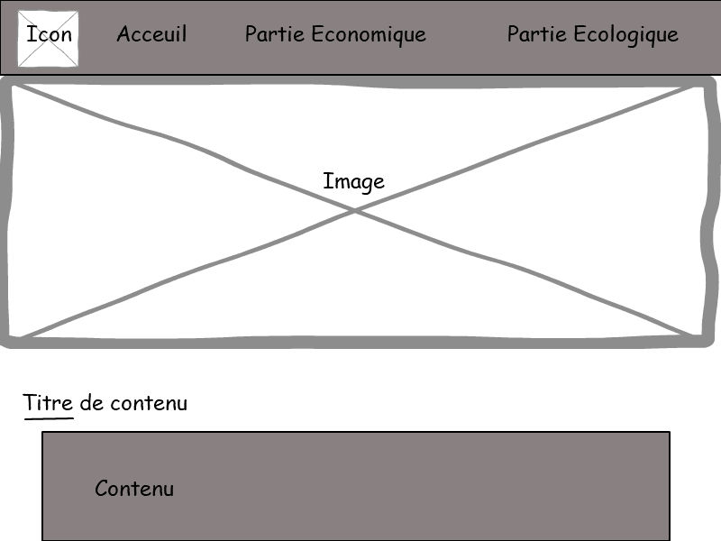
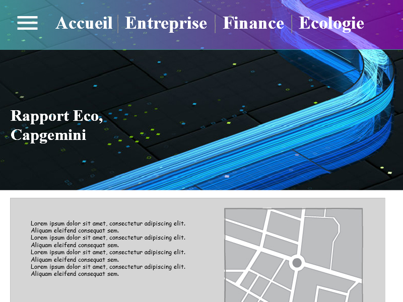
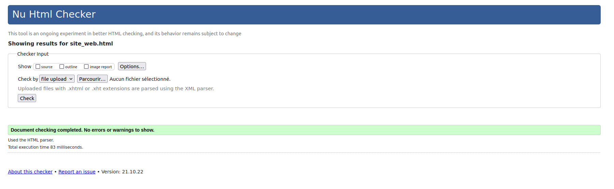
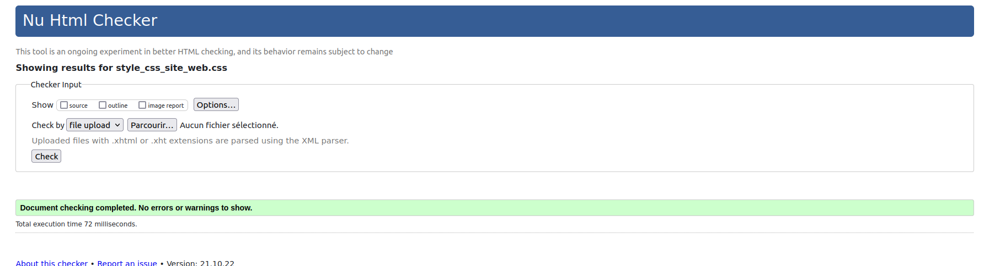

# Livrable parties Économie et Documents numérique
[Rapport Economique](doc/Fernandes_SAES106_C1_Capgemini.pdf)

# SAE_06_Capgemini
[Adrien Fernandes](mailto:adrien.fernandes@edu.univ-fcomte.fr?subject=[SAE 1.06]) 

Groupe C1 
Beaudru Messaline

Girard Mathéo

Fernandes Adrien

DESGRONTE Emmanuel(a changé de groupe car on était trop nombreux)

giuliana godail--fabrizio

Entreprise :Capgemini

Répartition:
  écran de zoning: Adrien
  prototype: Adrien + Mathéo
  chartre graphique: Giuliana + Messaline
  
  menu/acceuil: Giuliana + Mathéo + Adrien + Messaline
  Sous page d'acceuil: Giuliana + Messaline
  
  résumer les informations à mettre dans le site web: Mathéo + Messaline
  
  partie entreprise:
            caroussel: Adrien
            frise chronologique: Mathéo
            Implantation: Messaline
            Organisation de Capgemini:
                  Conseil d'administration: Messaline
                  Mixité Homme/femme: Mathéo
            
  partie économique:
            Capgemini un cabinet de conseil, pour quelles entreprises et quels secteurs?: Adrien
            Chiffre d’affaires et aspect financier: Giuliana
            Partenariat et concurrence: Giuliana
            
  partie ecologique: Adrien
  
  formulaire: Giuliana
  
  bouton téléchargement: Giuliana
  
  responsive: Adrien + Giuliana
 
 
Validateur:
  
  

  
  
